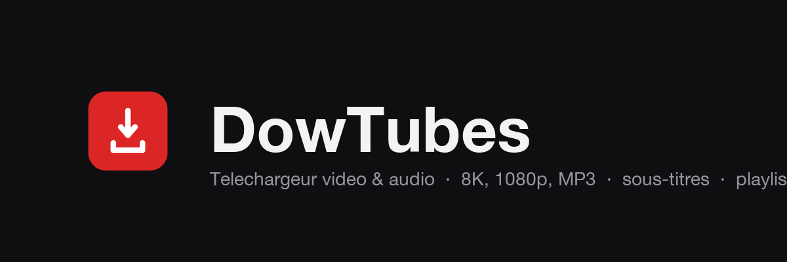

<p align="center">
  
</p>

<p align="center">
  <b>Téléchargeur vidéo &amp; audio moderne pour macOS &amp; Windows.</b><br>
  Une alternative à <i>Downie</i>, construite sur
  <a href="https://github.com/yt-dlp/yt-dlp">yt-dlp</a> +
  <a href="https://ffmpeg.org">ffmpeg</a>.
</p>

<p align="center">
  
  
  
  
</p>

---

Colle un lien (YouTube, Vimeo, et ~1800 autres sites), choisis la qualité, et
télécharge — vidéo, audio, ou les deux, avec sous-titres. Interface soignée,
file d'attente persistante, pause/reprise, et bien plus.

## ✨ Fonctionnalités

- 🎬 **Vidéo jusqu'en 8K** — 8K · 4K · 1440p · 1080p · 720p · 480p (les paliers proposés s'adaptent à ce que la source offre)
- 🎵 **Audio seul** — MP3 & M4A, avec **pochette** et métadonnées intégrées
- 💬 **Sous-titres** — choix de la langue, en fichier `.srt` ou incrustés
- 📃 **Playlists & chaînes** — « Tout télécharger » en un clic
- 📋 **File d'attente** — plusieurs téléchargements en parallèle (nombre réglable), **persistante** (survit au redémarrage)
- ⏸️ **Pause / reprise** — reprend exactement là où ça s'est arrêté
- ⚡ **Variantes** — depuis un élément déjà téléchargé, récupère une autre version (l'audio, une autre qualité) sans re-chercher le lien
- 🎨 **Interface moderne** — thème clair/sombre, taille estimée par qualité, progression détaillée, notifications
- 📎 **Confort** — coller le presse-papier, glisser-déposer un lien, menu natif macOS
- 🔒 **Refus du DRM par conception** — aucun contournement de protection

## 📥 Installation

Télécharge la dernière version depuis la page **[Releases](../../releases/latest)**, puis suis les étapes de ta plateforme.

### 🍎 macOS (puces Apple Silicon — M1/M2/M3/M4)

1. Ouvre `DowTubes-x.y.z-arm64.dmg` et glisse **DowTubes** dans **Applications**.
2. L'app n'est pas notarisée par Apple : au 1ᵉʳ lancement macOS peut afficher *« endommagé »* ou *« développeur non vérifié »*. Ouvre le **Terminal** et lève la quarantaine :
   ```bash
   xattr -dr com.apple.quarantine /Applications/DowTubes.app
   ```
3. Double-clique sur **DowTubes**. ✅

> Sur un **Mac Intel**, ce build ne fonctionne pas (architecture arm64 uniquement).

### 🪟 Windows

1. Lance `DowTubes.Setup.x.y.z.exe`.
2. L'installeur n'est pas signé : si **SmartScreen** s'affiche → *Informations complémentaires* → **Exécuter quand même**.

> yt-dlp, ffmpeg et un runtime Python sont **embarqués** — aucune dépendance à installer.

### 🍪 YouTube : « confirmez que vous n'êtes pas un robot »

Si YouTube réclame une vérification, ouvre **⚙️ Réglages → Cookies du navigateur** et choisis le navigateur où tu es **connecté à YouTube** (Chrome, Firefox, Safari…). L'app réutilise alors tes cookies pour t'authentifier.
- **Chrome / Edge / Brave** : au 1ᵉʳ usage, macOS demande l'accès au Trousseau → *Toujours autoriser*.
- **Safari** : nécessite l'*Accès complet au disque* (Réglages Système → Confidentialité et sécurité).
- **Firefox** : aucune invite — le plus simple.

## 🚀 Utilisation

1. **Colle** un lien (ou dépose-le sur la fenêtre / bouton coller).
2. Clique **Analyser**.
3. Choisis la **qualité** (vidéo ou audio) et, si tu veux, les **sous-titres**.
4. **Télécharger** → le fichier atterrit dans `~/Downloads/DowTubes`.

Une playlist ? L'app propose de **tout télécharger** à la qualité choisie.

## 🛠 Développement

```bash
npm install        # installe les deps + télécharge yt-dlp / ffmpeg / Python
npm run dev        # lance l'app en mode développement (hot-reload)

npm run dist:mac   # génère le .dmg (macOS)
npm run dist:win   # génère le .exe (Windows)
```

> Les installeurs des deux plateformes sont aussi générés automatiquement par
> **GitHub Actions** (`.github/workflows/build.yml`) à chaque tag `v*`.

## 🧱 Stack technique

**Electron 43** · **React 18** · **TypeScript** · **Vite / electron-vite** — au-dessus de
**yt-dlp** (moteur d'extraction), **ffmpeg / ffprobe** (montage, conversion, sous-titres),
un **Python standalone** embarqué + **mutagen** (pochettes). Empaquetage via **electron-builder**.

Points d'architecture : renderer **sandboxé** (IPC typé en allowlist, aucun accès direct au
système), yt-dlp lancé en tableau d'arguments (jamais en chaîne shell) et mis à jour **hors**
du bundle signé, sécurité renforcée (fuse `RunAsNode` désactivé).

## ⚖️ Usage responsable

DowTubes est un outil de téléchargement légal — l'usage relève de ta responsabilité.
Destiné au contenu **que tu as le droit de récupérer** (cours, tutoriels, contenus perso,
libres ou sous licence adéquate). L'app **refuse les contenus protégés par DRM** et
n'utilise que **tes propres cookies** de navigateur. Respecte les conditions d'utilisation
des plateformes et le droit d'auteur.

## 👤 Auteur

**Développé par B.A Abdoulaye.**

## Licence

[MIT](LICENSE) — © 2026 B.A Abdoulaye.
